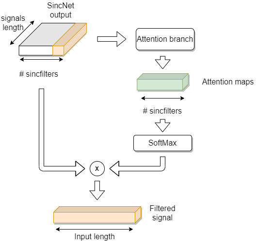

# DENet: a deep architecture for audio surveillance applications




This repository is the official implementation of [DENet: a deep architecture for audio surveillance applications](https://link.springer.com/article/10.1007/s00521-020-05572-5). 

For more information you can contact the authors at: agreco@unisa.it, aroberto@unisa.it, asaggese@unisa.it, mvento@unisa.it .

### Citations

If you use this code in your research, please cite this paper.

```bibtext
@article{greco2021denet,
  title={DENet: a deep architecture for audio surveillance applications},
  author={Greco, Antonio and Roberto, Antonio and Saggese, Alessia and Vento, Mario},
  journal={Neural Computing and Applications},
  doi={10.1007/s00521-020-05572-5},
  pages={1--12},
  year={2021},
  publisher={Springer}
}
```

DENet is a novel Recurrent Convolutional Neural Network architecture for audio surveillance applications. It is based on a new layer that we call Denoising-Enhancement (DE) Layer, which performs denoising and enhancement of the original signal by applying an attention map on the components of the band-filtered signal. 
Differently from state of the art methodologies, DENet takes as input the lossless raw waveform and is able to automatically learn the evolution of the frequencies-of-interest over time, by combining the proposed layer with a Bidirectional Gated Recurrent Unit. Using the feedbacks coming from classifications related to consecutive frames (i.e. that belong to the same event), the proposed method is able to drastically reduce the misclassifications.

## Requirements

- tensorflow-gpu==1.13.1
- keras==2.2.4
- numpy==1.19.1

To install the requirements:

```bash
git clone https://github.com/MiviaLab/DENet.git
cd DENet
pip install -r requirements.txt
```

## Usage

```python
get_denet(input_shape, n_classes, sr=16000, before_pooling=True, dropout=0.3)
``` 

- *input_shape*: tuple in the form (seq_len, samples, 1)
- *n_classes*: number of dense units in the last layer  
- *sr*: input sampling rate
- *before_pooling*: set it to False to put the DELayer after the MaxPooling and the Activation Layers 
- *dropout*: dropout probability for all the Dropout layers in the network

## Example

```python
import numpy as np
from denet import get_denet

# Settings
batch_size = 100

seq_len = 10 # number of frames in the sequence
samples = 400 # frame_size * sample_rate

input_shape = (seq_len, samples, 1)

sample_rate = 16000
n_classes = 10


# Get the model
model = get_denet(input_shape, n_classes, sr=sample_rate, before_pooling=False)

# Print the model 
model.summary()

# Predict random data
X = np.random.rand(batch_size, seq_len, samples, 1)
y = model.predict(X)

print(y.shape)
```

## Results

Our model achieves the following performance on :

### [MIVIA Audio Events dataset](https://mivia.unisa.it/datasets/audio-analysis/mivia-audio-events/)

- RR: Recognition Rate (Recall)
- MR: Miss Rate
- ER: Error Rate
- FPR: False Positive Rate

| Method   | RR    | MR    | ER    | FPR   |
|----------|-------|-------|-------|-------|
| DENet    | 0.975 | 0.014 | 0.011 | 0.029 |
| [SincNet](https://dl.acm.org/doi/abs/10.1145/3378184.3378186)  | 0.971 | 0.019 | 0.010 | 0.029 |
| [COPE](https://www.sciencedirect.com/science/article/pii/S0031320319301232)     | 0.960 | 0.031 | 0.009 | 0.043 |
| [SoundNet](https://papers.nips.cc/paper/2016/hash/7dcd340d84f762eba80aa538b0c527f7-Abstract.html) | 0.933 | 0.007 | 0.060 | 0.223 |

### [MIVIA Road Events dataset](https://mivia.unisa.it/datasets/audio-analysis/mivia-road-audio-events-data-set/)

| Method                  | RR    | MR    | ER    | FPR   |
|-------------------------|-------|-------|-------|-------|
| DENet (Fine-Tuning)     | 0.998 | 0.002 | 0.000 | 0.043 |
| [MobileNet](https://link.springer.com/chapter/10.1007/978-3-030-30645-8_53) (Fine-Tuning) | 0.995 | 0.000 | 0.005 | 0.037 |
| DENet                   | 0.975 | 0.025 | 0.000 | 0.021 |
| [MobileNet](https://link.springer.com/chapter/10.1007/978-3-030-30645-8_53)               | 0.965 | 0.010 | 0.028 | 0.067 |
| [COPE](https://www.sciencedirect.com/science/article/pii/S0031320319301232)                    | 0.940 | 0.048 | 0.012 | 0.067 |
| [SincNet](https://dl.acm.org/doi/abs/10.1145/3378184.3378186)                 | 0.773 | 0.200 | 0.027 | 0.010 |


### License
The code and mode are available to download for commercial/research purposes under a Creative Commons Attribution 4.0 International License(https://creativecommons.org/licenses/by/4.0/).

      Downloading this code implies agreement to follow the same conditions for any modification 
      and/or re-distribution of the dataset in any form.

      Additionally any entity using this code agrees to the following conditions:

      THIS CODE IS PROVIDED BY THE COPYRIGHT HOLDERS AND CONTRIBUTORS "AS
      IS" AND ANY EXPRESS OR IMPLIED WARRANTIES, INCLUDING, BUT NOT LIMITED
      TO, THE IMPLIED WARRANTIES OF MERCHANTABILITY AND FITNESS FOR A
      PARTICULAR PURPOSE ARE DISCLAIMED. IN NO EVENT SHALL THE COPYRIGHT
      HOLDER BE LIABLE FOR ANY DIRECT, INDIRECT, INCIDENTAL, SPECIAL,
      EXEMPLARY, OR CONSEQUENTIAL DAMAGES (INCLUDING, BUT NOT LIMITED TO,
      PROCUREMENT OF SUBSTITUTE GOODS OR SERVICES; LOSS OF USE, DATA, OR
      PROFITS; OR BUSINESS INTERRUPTION) HOWEVER CAUSED AND ON ANY THEORY OF
      LIABILITY, WHETHER IN CONTRACT, STRICT LIABILITY, OR TORT (INCLUDING
      NEGLIGENCE OR OTHERWISE) ARISING IN ANY WAY OUT OF THE USE OF THIS
      SOFTWARE, EVEN IF ADVISED OF THE POSSIBILITY OF SUCH DAMAGE.

      Please cite the paper if you make use of the dataset and/or code.
